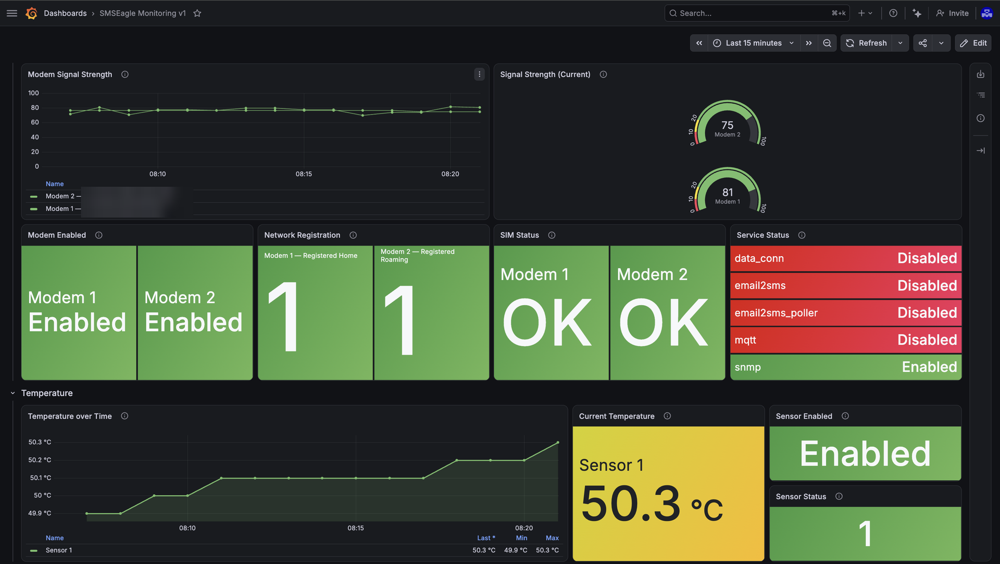
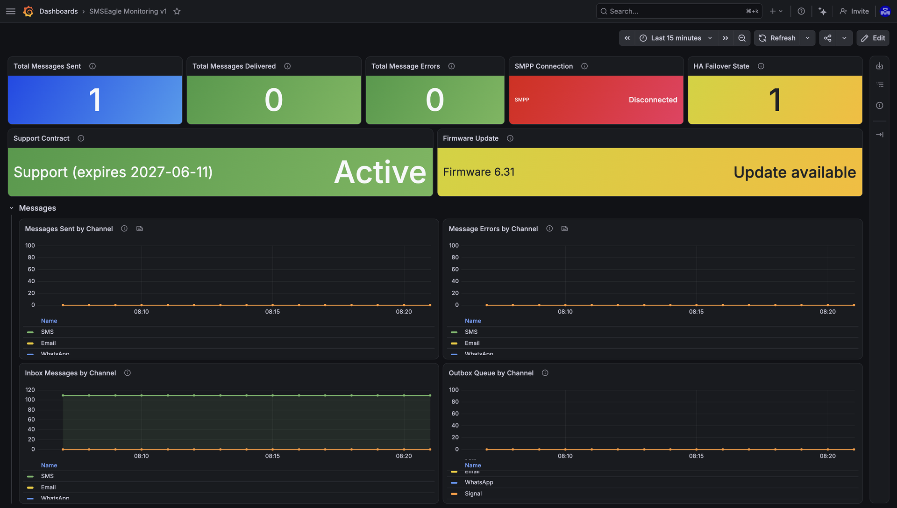

# smseagle-monitoring

Monitor an [SMSEagle](https://www.smseagle.eu/) hardware SMS gateway and ship
its metrics to **Grafana Cloud**. All data is pulled from the **SMSEagle APIv2**
(no SNMP) — a [json-exporter](https://github.com/prometheus-community/json_exporter)
sidecar turns the JSON responses into Prometheus metrics, which
[Grafana Alloy](https://grafana.com/docs/alloy/) scrapes and remote-writes.

A built-in **offline mock** replays captured API responses so you can develop
without access to the device.

## 🎬 Video tutorial

Prefer to follow along? Watch the full setup walkthrough:
[**Grafana SMSEagle monitoring on YouTube**](https://youtu.be/luwVy0uvcm4).

## Architecture

```
SMSEagle APIv2 ──JSON──▶ json-exporter ──Prometheus──▶ Alloy ──remote_write──▶ Grafana Cloud
       ▲
       └── (offline) mock-smseagle replays captured responses
```

| Service | Image | Purpose |
|---------|-------|---------|
| `alloy` | `grafana/alloy` | Scrapes metrics, remote-writes to Grafana Cloud. UI on `:12345` |
| `json-exporter` | `prometheuscommunity/json-exporter` | Maps SMSEagle JSON → Prometheus. `:7979` |
| `mock-smseagle` | `nginx:alpine` | Serves captured API responses for offline dev. `:8088` |

## Quick start

1. Clone the repository and enter this project's folder:
   ```bash
   git clone https://github.com/dmitrylambert/grafana-monitoring.git
   cd grafana-monitoring/smseagle-monitoring
   ```

2. Copy the env template and fill it in:
   ```bash
   cp .env.example .env
   ```
   Set your SMSEagle APIv2 token and Grafana Cloud Prometheus credentials.

3. Start the stack:
   ```bash
   docker compose up -d
   ```

4. Check it locally:
   - Alloy UI: <http://localhost:12345>
   - Mock API: <http://localhost:8088/api/v2/modem/full_info>

## Live device vs offline mock

Toggle the data source with a single line in `.env`, then re-apply:

```bash
# MOCK (offline, no device needed):
SMSEAGLE_API_URL=http://mock-smseagle/api/v2
# LIVE (requires LAN access to the device):
# SMSEAGLE_API_URL=https://<device-ip>/api/v2

docker compose restart alloy   # config/env changes need a restart, not `up -d`
```

The APIv2 token is passed as the `access_token` query parameter, so the mock
simply ignores it — any dummy value works in mock mode.

## Metrics

| Metric | Labels | Source |
|--------|--------|--------|
| `smseagle_modem_signal_strength` | `modem_no, net_name, sim_status, registration_status, imei` | `/modem/full_info` |
| `smseagle_modem_enabled` | `modem_no` | `/modem/full_info` |
| `smseagle_modem_sim_status` | `modem_no, sim_status` (value=1) | `/modem/full_info` |
| `smseagle_modem_network_registration` | `modem_no, registration_status` (value=1) | `/modem/full_info` |
| `smseagle_messages_{inbox,outbox,sent,error,delivered}` | `channel` (sms/whatsapp/signal/email) | `/messages[/<ch>]/count` |
| `smseagle_update_available` | `version` | `/device/version` |
| `smseagle_support_active` | `expiry_date` | `/device/support` |
| `smseagle_service_enabled` | `service` (snmp/mqtt/email2sms/email2sms_poller/data_conn) | `/device/<svc>/status` |
| `smseagle_smpp_{enabled,connection,core,sms,sql}` | – | `/device/smpp/status` |
| `smseagle_ha_failover_state` | `status` (value=1) | `/device/ha_failover/status` |
| `smseagle_temperature_celsius` | `sensor_id` | `/device/temperature_sensor/<id>/read` |
| `smseagle_humidity_percent` | `sensor_id` | `/device/temperature_sensor/<id>/read` |
| `smseagle_temperature_sensor_enabled` | – | `/device/temperature_sensor/<id>/status` |
| `smseagle_temperature_sensor_status` | `status` (value=1) | `/device/temperature_sensor/<id>/status` |

### Example alert queries

```promql
smseagle_messages_outbox{channel="sms"} > 20             # outbox backing up
increase(smseagle_messages_error{channel="sms"}[15m]) > 0  # new send failures
smseagle_modem_sim_status{sim_status!="Operational"}     # SIM problem
smseagle_modem_signal_strength < 30                      # weak signal
```

## Dashboard

A ready-to-import Grafana dashboard lives at
[`dashboards/smseagle.json`](./dashboards/smseagle.json) — panels for message
totals/queues, modem signal, SIM & network health, services, SMPP subsystems,
firmware/support, and temperature/humidity.




### How to import

1. Get the JSON — either:
   - download/copy [`dashboards/smseagle.json`](./dashboards/smseagle.json) from
     this repo, or
   - copy its raw contents to your clipboard.
2. In Grafana, open the menu → **Dashboards**.
3. Click **New** (top right) → **Import**.
4. Provide the dashboard:
   - **Upload dashboard JSON file** and select `smseagle.json`, **or**
   - paste the JSON into the **Import via dashboard JSON model** box, then click
     **Load**.
5. On the import screen, set:
   - **Name** / **Folder** — optional, change if you like.
   - **Prometheus** data source — pick the data source that receives your
     SMSEagle metrics (e.g. your Grafana Cloud Prometheus). The dashboard ships
     with the source parameterized, so it will prompt you here.
6. Click **Import**.

The dashboard opens on the **last 6 hours**. If panels read "No data", confirm
metrics are arriving (`{__name__=~"smseagle_.+"}` in **Explore**) and that the
selected data source is correct.

> While the stack runs against the **mock**, values are static — status panels
> show green/OK and graphs are flat. Switch `.env` to the live device for real
> readings.

### Updating an existing copy

Re-importing the same JSON with the **same UID** overwrites your copy
(Grafana will warn before replacing). To keep edits, import under a new name or
change the dashboard UID before importing.

## Refreshing the mock snapshots

The files under `mock/api/v2/` are captured API responses. To refresh them from
a live device, point `.env` at the live device and run:

```bash
./tools/snapshot-api.sh
```

> The committed mock data uses dummy IMEI/IMSI/carrier values.

## Adding more endpoints

1. Add a module mapping in `json-exporter/config.yml` (paths use Kubernetes
   JSONPath, e.g. `{.field}`; `{[*]}` iterates an array, `{$}` selects a single
   object).
2. Add a scrape target in `alloy/config.alloy`.
3. `docker compose restart json-exporter alloy`.

---

### Need help with your project?

[**www.dmitrylambert.com**](https://www.dmitrylambert.com)

- 🛠️ **Custom development**
- 📊 **Monitoring & Observability**
- 🎬 **Promotional videos**

Connect: [Dmitry Lambert (LinkedIn)](https://www.linkedin.com/in/dmitry-lambert/) · [KorFlux (LinkedIn)](https://www.linkedin.com/company/korflux/)
